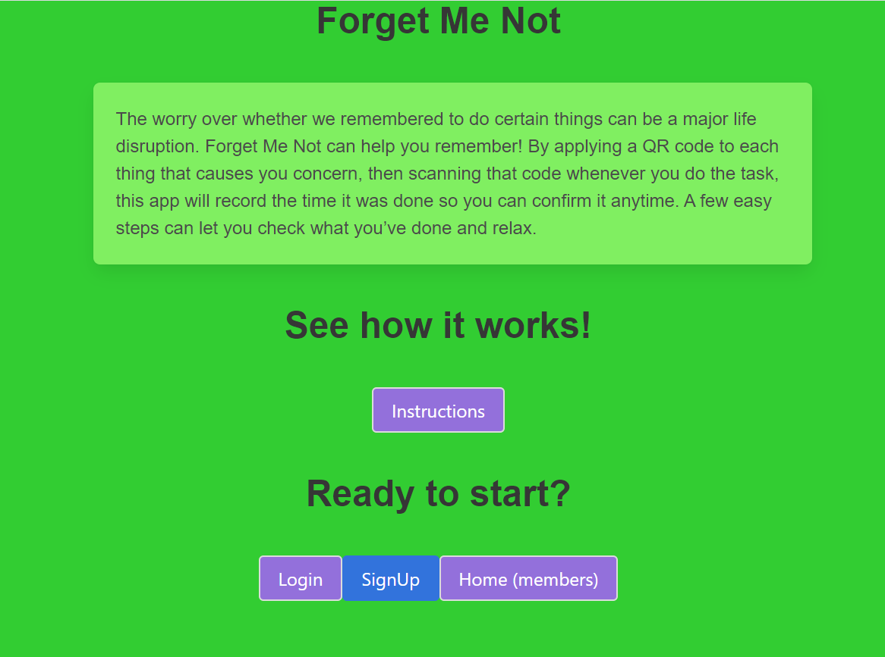
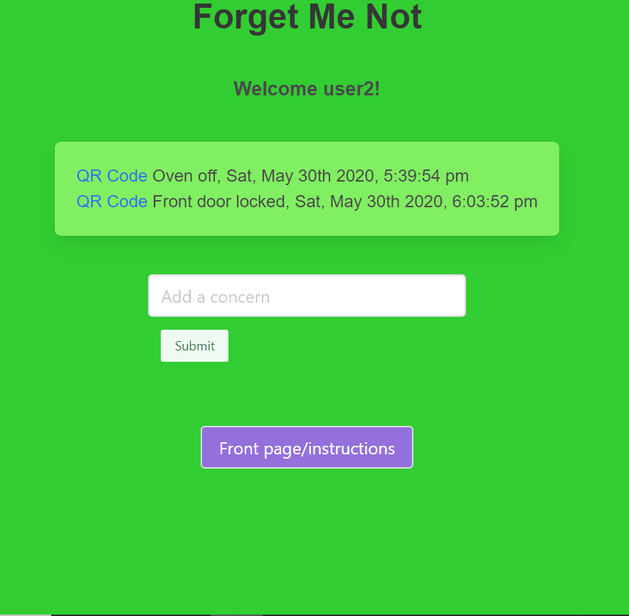

# Project3-ForgetMeNot
## User Story

```
AS A person who struggles with anxiety, OCD or dementia
I WANT TO be able to confirm when I last checked certain items of concern, like whether a door is locked or the oven is off
SO THAT my life is not disrupted by the need to go back and check

```

## Description

Forget Me Not is a simple app that allows a user to enter an item or location, such as the oven or the front door, and assign it a QR Code.  Then the user can print that code and tape it near the item to be checked.  When the user turns off the oven or locks the door when leaving home, they scan the QR code, which applies a timestamp displayed on the app’s home page. This act alone might better commit the action to memory.  But if the user wonders later if the thing was done, one look at the home page and most recent timestamp for that item will give confirmation and peace of mind (or tell them that they really do need to go home!).

## Completed/Technologies Used

* Bulma CSS framework
* React/Express
* MongoDB and mongoose
* QR codes and QR code reader phone app
* QR code generator = qrcode.react npm package
* Heroku deployment

## Application URLs - 

Deployed: https://forget-me-not-project-3.herokuapp.com/

GitHub: https://github.com/robynp108/Project3-ForgetMeNot 

## Application Screenshots




